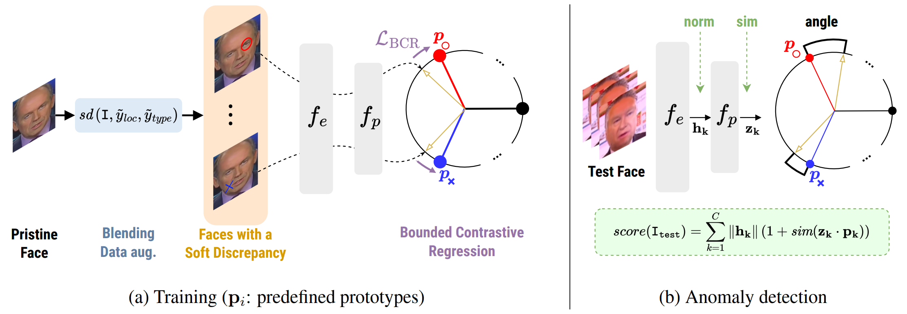

# SeeABLE: Soft Discrepancies and Bounded Contrastive Learning for Exposing Deepfakes

This is the codebase behind SeeABLE



## Requirements

You need git and conda/mamba.


You need Hydra to run this framework
See `conf` dir for possible config.

## Setup

### 1. Clone this github repo and install its requirements:

```sh
git clone https://github.com/anonymous-author-sub/seeable.git
cd seeable
```

### 2. Mamba installation

If you don't have conda, you can install it yourself or choose mamba (faster).
Follow this link to install it using mambaforge.
Latest installers with Mamba in the base environment:

| OS      | Architecture          | Download  |
| --------|-----------------------|-----------|
| Linux   | x86_64 (amd64)        | [Mambaforge-Linux-x86_64](https://github.com/conda-forge/miniforge/releases/latest/download/Mambaforge-Linux-x86_64.sh) |
| OS X    | x86_64                | [Mambaforge-MacOSX-x86_64](https://github.com/conda-forge/miniforge/releases/latest/download/Mambaforge-MacOSX-x86_64.sh) |
| OS X    | arm64 (Apple Silicon) | [Mambaforge-MacOSX-arm64](https://github.com/conda-forge/miniforge/releases/latest/download/Mambaforge-MacOSX-arm64.sh) |
| Windows | x86_64                | [Mambaforge-Windows-x86_64](https://github.com/conda-forge/miniforge/releases/latest/download/Mambaforge-Windows-x86_64.exe) |

After installing Mambaforge, verify that it is working by running the following command:

```bash
mamba --version
```

This should print the version of Mambaforge that you have installed.

### 3. Install the environment

The environment can be installed using conda/mamba

```sh
conda env create -f environment.yml
```

## Instruction


### Activate the environment

```sh
conda activate seeable
```

TODO


